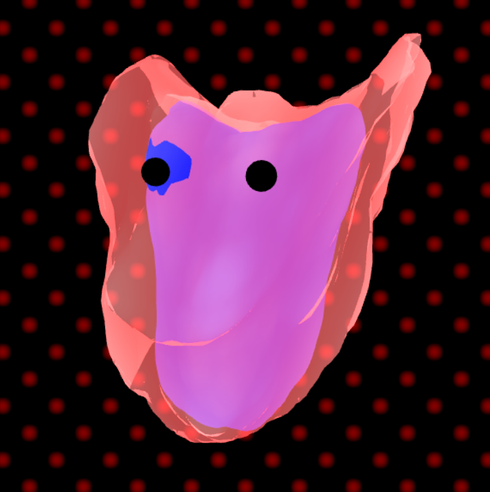

# [Project 1: Noise](https://github.com/CIS-566-Fall-2022/hw01-fireball-base)

## Link

https://ldooley-penn.github.io/hw01-fireball/

## Overview

I wanted to create a flame-like character, so I started by shaping the ears.
I did this by using a cosine in x multiplied by one in y, which creates
a potato chip shape that I thought would be a good start. I then wanted 
to pull the ears back as they went up, so I used an easing function
along with the vertex y position to displace them backwards.

To give it a more dynamic flame-like appearance, I used worley noise. But to make
it smoothly move up the character over time, I added a displacement
in an upwards and back direction that increased over time, which made the bumpy
surface roll up the character's head. I also added an inner flame by scaling down
the outer surface and making it opaque.

I used a handful of functions to give the flames a dirty pulsing appearance 
that kind of looks like streaks of dust or wind to highlight the bumps. I
started by using a triangle wave to map the domain of time being [0, infinity)
to an oscillating [0, 1] range. Once I had the 0 to 1 oscillator, 
I mapped this using a gain function to spend more time at the ends of
the animation. I used smootherstep to actually do the color
mapping, so the white and base colors would be more accents.

I also added a background that pulses between red and black dots 
using sinusoidal functions.
